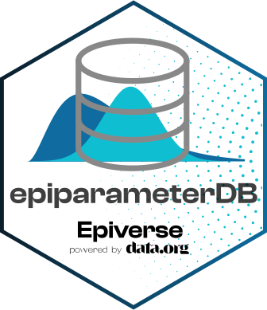

<!-- README.md is generated from README.Rmd. Please edit that file. -->
<!-- The code to render this README is stored in .github/workflows/render-readme.yaml -->
<!-- Variables marked with double curly braces will be transformed beforehand: -->
<!-- `packagename` is extracted from the DESCRIPTION file -->
<!-- `gh_repo` is extracted via a special environment variable in GitHub Actions -->

# `{epiparameterDB}` 

<!-- badges: start -->

[](https://opensource.org/license/mit)
[](https://github.com/epiverse-trace/epiparameterDB/actions/workflows/R-CMD-check.yaml)
[](https://app.codecov.io/gh/epiverse-trace/epiparameterDB?branch=main)
[](https://lifecycle.r-lib.org/articles/stages.html#experimental)
<!-- badges: end -->

`{epiparameterDB}` provides a database of epidemiological parameters. It
stores the data for the `{epiparameter}` R package.

We recommend reading the epidemiological parameters via the
`epiparameter::epiparameter_db()` function rather than using this
package. `epiparameter::epiparameter_db()` function formats the
epidemiological parameters into `<epiparameter>` objects and organises
the object elements (e.g. into R classes like `<distribution>` and
`<bibentry>`), whereas reading the parameter database
(`parameters.json`) in this package will provide a list of information.

`{epiparameterDB}` is developed at the [Centre for the Mathematical
Modelling of Infectious
Diseases](https://www.lshtm.ac.uk/research/centres/centre-mathematical-modelling-infectious-diseases)
at the [London School of Hygiene and Tropical
Medicine](https://www.lshtm.ac.uk/) as part of
[Epiverse-TRACE](https://data.org/initiatives/epiverse/).

## Installation

You can install `{epiparameterDB}` from CRAN with:

``` r
install.packages("epiparameterDB")
```

You can install the development version of `{epiparameterDB}` from
[GitHub](https://github.com/) with:

``` r
# install.packages("pak")
pak::pak("epiverse-trace/epiparameterDB")
```

## Usage

``` r
library(epiparameterDB)
data(package = "epiparameterDB")
```

## Contributing to library of epidemiological parameters

Parameters can be added to the [JSON file holding the
data](https://github.com/epiverse-trace/epiparameter/blob/main/inst/extdata/parameters.json)
base directly via a Pull Request.

You can find explanation of accepted entries for each column in the
[data
dictionary](https://github.com/epiverse-trace/epiparameterDB/blob/main/inst/extdata/data_dictionary.json).

There are simpler ways to add to the epidemiological parameter database
outlined in the `README` of the `{epiparameter}` package.

## Help

To report a bug please open an
[issue](https://github.com/epiverse-trace/epiparameterDB/issues/new/choose)

## Contributions

Contributions to `{epiparameterDB}` are welcomed. [package contributing
guide](https://github.com/epiverse-trace/.github/blob/main/CONTRIBUTING.md).

Contributions are welcome via [pull
requests](https://github.com/epiverse-trace/epiparameterDB/pulls).

## Code of Conduct

Please note that the `{epiparameterDB}` project is released with a
[Contributor Code of
Conduct](https://github.com/epiverse-trace/.github/blob/main/CODE_OF_CONDUCT.md).
By contributing to this project, you agree to abide by its terms.

### Related projects

This project is related to other existing projects in R or other
languages, but also differs from them in the following aspects:

- `{epireview}`: An R package containing epidemiological parameters for
  a range of priority pathogens (e.g. Ebola, Lassa and SARS). These can
  be read into R as tabular data. To fully utilise data stored in
  `{epireview}` we recommend converting the epidemiological parameter of
  choice into an `<epiparameter>` object using
  `epiparameter::as_epiparameter()`, see [`data_from_epireview`
  vignette](https://epiverse-trace.github.io/epiparameter/articles/data_from_epireview.html).

## Citing this package

``` r
citation("epiparameterDB")
#> To cite package 'epiparameterDB' in publications use:
#> 
#>   Lambert J, Kucharski A, Tamayo C (2024). _epiparameterDB: Database of
#>   Epidemiological Parameters_. R package version 0.1.0,
#>   https://epiverse-trace.github.io/epiparameterDB/,
#>   <https://github.com/epiverse-trace/epiparameterDB/>.
#> 
#> A BibTeX entry for LaTeX users is
#> 
#>   @Manual{,
#>     title = {epiparameterDB: Database of Epidemiological Parameters},
#>     author = {Joshua W. Lambert and Adam Kucharski and Carmen Tamayo},
#>     year = {2024},
#>     note = {R package version 0.1.0, 
#> https://epiverse-trace.github.io/epiparameterDB/},
#>     url = {https://github.com/epiverse-trace/epiparameterDB/},
#>   }
```
